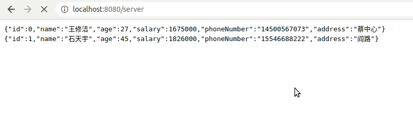
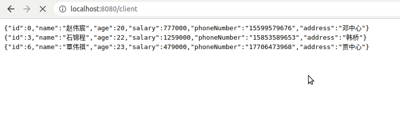
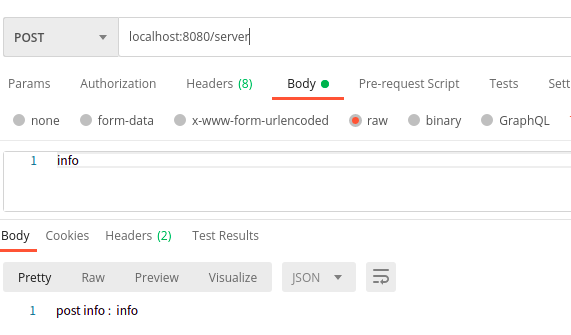
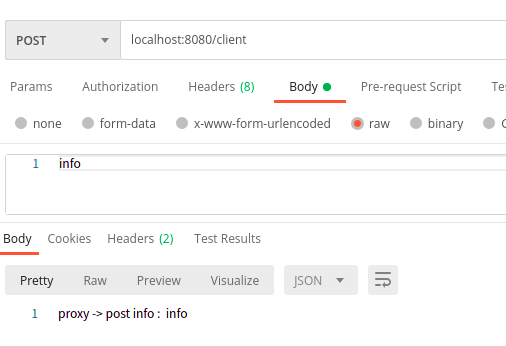
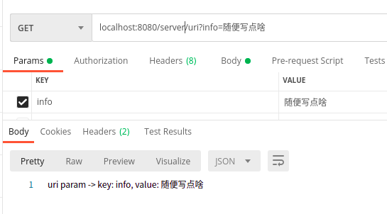
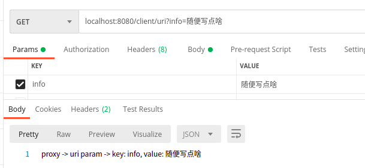
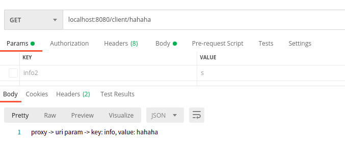
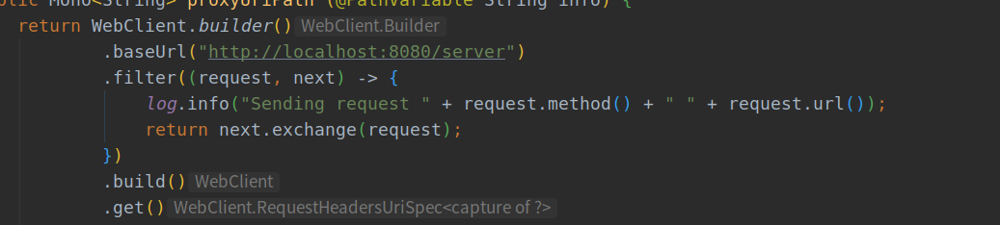

# Spring WebFlux (5):  WebClient使用

可以使用WebFlux的WebClient类很方便的对网络请求进行代理处理操作，我想Spring Cloud Gateway中主要用的就是WebClient进行操作，这里简单介绍一下WebClient的用法，想要深度学习的话，看一下Spring Cloud Gateway源码准没错


## 一些用法

### 流数据

首先创建一个server端，用于产生一些网络服务：

+ Employee为员工类
+ EmployeeFaker为通过javafaker包生成的一些数据
+ EmployeeController生成一些服务，其中getEmployee为每一秒生成一个Employee对象，因为是流数据使用`APPLICATION_STREAM_JSON_VALUE`进行传输

```java
@Data
@Builder
@NoArgsConstructor
@AllArgsConstructor
class Employee {
    Long id;
    String name;
    Integer age;
    Integer salary;
    String phoneNumber;
    String address;
}

class EmployeeFaker extends Employee{
    private final Faker f = new Faker(Locale.CHINA);

    public EmployeeFaker (long i) {
        id = i;
        name = f.name().fullName();
        age = f.random().nextInt(20, 50);
        salary = f.number().numberBetween(1, 2000)*1000;
        phoneNumber = f.phoneNumber().cellPhone();
        address = f.address().streetName();
    }
}

@RestController
@RequestMapping("server")
class EmployeeController {

    @GetMapping(produces = MediaType.APPLICATION_STREAM_JSON_VALUE)
    public Flux<Employee> getEmployee() {
        return Flux.interval(Duration.ofSeconds(1))
                .map(EmployeeFaker::new);
    }

    @PostMapping(produces = MediaType.APPLICATION_JSON_VALUE)
    public Mono<String> post (@RequestBody String info) {
        return Mono.just(info)
                .map(i -> "post info :  " + i);
    }
}
```

运行之后测试服务：



使用WebClient编写接收：

+ 这里通过WebClient访问localhost:8080/server
+ 然后将结果转为Flux
+ 然后进行筛选，只留年龄小于25的返回

```java
@GetMapping(produces = MediaType.APPLICATION_STREAM_JSON_VALUE)
public Flux<Employee> proxyEmploy() {
    return WebClient.create("localhost:8080/server")
            .get()
            .retrieve()
            .bodyToFlux(Employee.class)
            .log()
            .filter(i -> i.getAge() < 25);
}
```

看下结果：



流程大概为：

访问`localhost:8080/client`-> webClient 访问`localhost:8080/server` -> server返回结果-> filter-> client 返回结果

### post请求

创建post服务：

+ 将post的内容加上`post info：`

```java
@PostMapping(produces = MediaType.APPLICATION_JSON_VALUE)
public Mono<String> post (@RequestBody String info) {
    return Mono.just(info)
            .map(i -> "post info :  " + i);
}
```



对应的webclient服务：

+ 传入的内容通过body写入请求中
+ 通过访问将结果前加proxy -> 字符返回

```java
@PostMapping(produces = MediaType.APPLICATION_JSON_VALUE)
public Mono<String> proxyPost (@RequestBody Mono<String> info) {
    return WebClient.builder() // 除了使用create快速生成 外还可以使用builder创建
            .baseUrl("localhost:8080/server")
            .build()
            .post()
            .body(info, String.class)  // 将info body 写入 proxy请求的body中
            .retrieve()
            .bodyToMono(String.class)
            .map(i -> "proxy -> " + i);
}
```

结果跟预期一致：



### get请求传参（uri处理）

众所周知get传参两种方法：

+ queryParam：`localhost:8080/client/uri?info=随便写点啥&info2=s`通过问好分隔path和参数&分隔不同参数
+ path：通过path中的路由传递参数

#### queryParam

+ 创建一个测试服务通过query传参

```java
@GetMapping(value = "uri", produces = MediaType.APPLICATION_JSON_VALUE)
public Mono<String> uri(@RequestParam("info") String info) {
    return Mono.just(info)
            .map(i -> "uri param -> key: info, value: " + i);
}
```



+ webclient接收端

```java
@GetMapping(value = "uri", produces = MediaType.APPLICATION_JSON_VALUE)
public Mono<String> proxyUri (@RequestParam("info") String info) {
    return WebClient.builder()
            .baseUrl("http://localhost:8080/server")
            .build()
            .get()
            .uri(u -> u.path("/uri")
                    .queryParam("info", info)
                    .build()
            )
            .retrieve()
            .bodyToMono(String.class)
            .map(i -> "proxy -> " + i);
}
```



#### path传参

+ server

```java
@GetMapping(value = "{info}", produces = MediaType.APPLICATION_JSON_VALUE)
public Mono<String> uriPath(@PathVariable String info) {
    return Mono.just(info)
            .map(i -> "uri param -> key: info, value: " + i);
}
```

+ proxy

```java
@GetMapping(value = "{info}", produces = MediaType.APPLICATION_JSON_VALUE)
public Mono<String> proxyUriPath (@PathVariable String info) {
    return WebClient.builder()
            .baseUrl("http://localhost:8080/server")
            .build()
            .get()
            .uri(u -> u.path("/{info}")
                    .build(info)
            )
            .retrieve()
            .bodyToMono(String.class)
            .map(i -> "proxy -> " + i);
}
```



### 过滤 filter 使用

+ 在build时可以添加过滤
+ 可以添加多个



+ 可以通过`ExchangeFilterFunction.ofResponseProcessor`和`ExchangeFilterFunction.ofRequestProcessor`对分别对request和response做处理

```java
private ExchangeFilterFunction logResponse () {
    return ExchangeFilterFunction.ofResponseProcessor(c -> {
        c.headers().asHttpHeaders()
                .forEach((k, vs) -> vs.forEach(v -> log.info("Response header: {} {}", k, v)));
        return Mono.just(c);
    });
}
```


## 代码

github